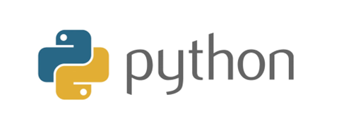
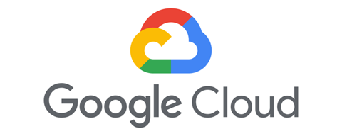
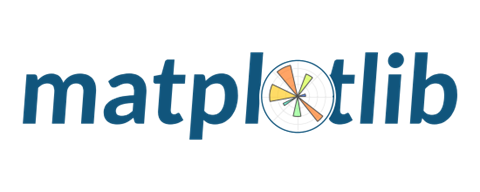
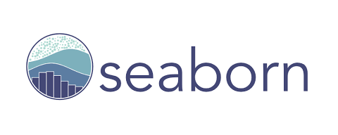
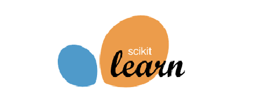
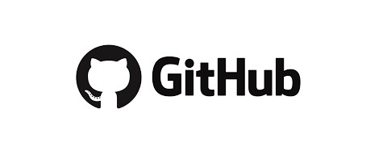
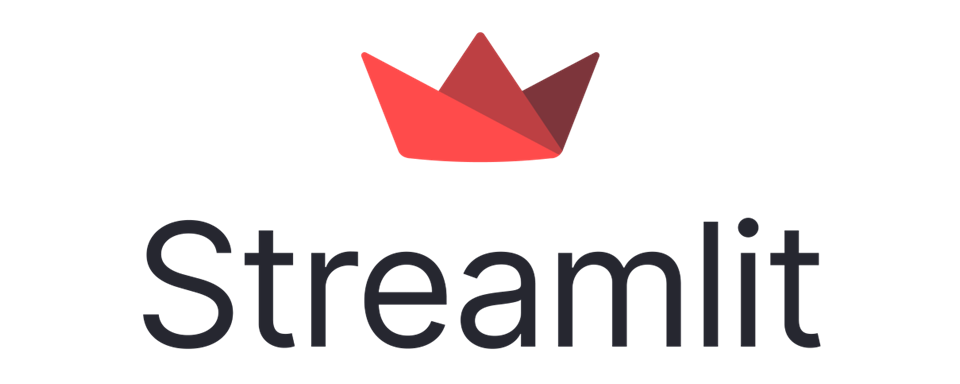
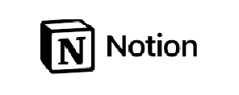
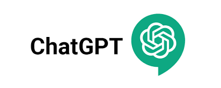
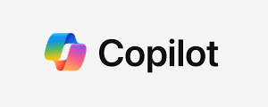

# 

   <h1>  Hola...! Somos la Empresa BEAUTY CONSULTING   </h1>

Somos una empresa líder en el análisis de datos, ingenieria de datos y ciencia de datos que se especializa en ayudar a organizaciones de diversos sectores a aprovechar al máximo sus datos para obtener información significativa en la toma decisiones estratégicas. Nuestro equipo de expertos en datos combina habilidades técnicas avanzadas con un profundo conocimiento del negocio para ofrecer soluciones personalizadas que impulsen el éxito de nuestros clientes.

# Índice
* [Sistema de Recomendación de Nail Salons](#Sistema-de-Recomendación-de-Nail-Salons)
  * [Objetivo](#Objetivo )
  * [Objetivos Específicos](#Objetivos-Específicos)
  * [Alcance ](#Alcance)
  * [Justificación ](#Justificación) 
  * [Modelo de Negocio](#Modelo-de-Negocio)
  * [Metodología de Trabajo](#Metodología-de-Trabajo)
  * [Diagrama de Gantt](#Diagrama-de-Gantt)
  * [Tegnologías Utilizadas](#Tegnologías-Utilizadas)
  * [Diagrama Entidad Relación](#Diagrama-Entidad-Relación)
* [Data Engineer](#Data-Engineer)
* [Data Analytics](#Data-Analytics)
* [Machine Learning](#Machine-Learning)
* [Diapositivas-Láminas del Proyecto](#Diapositivas-Láminas-del-Proyecto)
* [Roles](#Roles)
    

# Sistema de Recomendación de Nail Salons
## Mejorando la Experiencia del Cliente en el Cuidado de Uñas :nail_care:

## Objetivo 

Desarrollar un sistema de recomendación de establecimientos de *Nail Salons* que proporcione sugerencias personalizadas y relevantes a los usuarios, con el fin de mejorar su experiencia en el cuidado de las uñas y aumentar su satisfacción con los servicios ofrecidos.
 [Volver al Índice](#Índice)

## Objetivos Específicos

* Aumentar las reseñas semestrales 
* Incrementar la tasa de satisfaccion del cliente 
* Incrementar el promedio de rating positivos 

 [Volver al Índice](#Índice)

## Alcance 
El alcance inicial del proyecto estará limitado al estado de Florida (USA), abarcando ciudades importantes como Miami, Orlando, Tampa, Jacksonville y otras regiones clave.

### Datos Temporales:
La recopilación y análisis de datos se centrará en el período del 2018 a 2022. Esto permitirá una comprensión detallada de las tendencias y cambios en la industria de la belleza en el transcurso de estos años

### Usuarios Objetivo:
 Los usuarios objetivo serán aquellos que buscan servicios de manicura en el estado de Florida durante el período mencionado del estado de florida. La plataforma estará diseñada para adaptarse a las preferencias y comportamientos específicos de los consumidores en esta región.

### Expansión Geográfica:
En un futuro después de una fase exitosa en Florida, se contempla la posibilidad de expandir la plataforma a otros estados de los Estados Unidos. También considerará la integración de nuevos servicios de belleza y bienestar para proporcionar una solución integral a los usuarios.
 [Volver al Índice](#Índice)

## Justificación 
### Oportunidad de Innovación Tecnológica:
 La implementación de un sistema de recomendación utiliza tecnologías avanzadas para mejorar la experiencia del usuario. Esto no solo satisface las expectativas de los clientes modernos sino que también posiciona a los salones en la vanguardia de la innovación tecnológica en la industria de la belleza.

### Impacto en la Experiencia del Usuario y la Fidelización:
 La plataforma se centra en mejorar la experiencia del usuario, desde la búsqueda hasta la reserva y la interacción con los salones. Una experiencia positiva tiene el potencial de aumentar la fidelización de los clientes, contribuyendo a la sustentabilidad y el crecimiento del proyecto a largo plazo.
 [Volver al Índice](#Índice)

## Modelo de Negocio

### Publicidad para Salones de Uñas:
Permitir que los salones de uñas paguen por publicidad destacada en el sistema. Esto podría incluir destacar sus servicios, promociones especiales o cupones de descuento para atraer a nuevos clientes. Pueden pagar una tarifa mensual para aparecer en la parte superior de las recomendaciones y destacar comentarios positivos en su perfil

## Perspectiva a Futuro

### Cobro por Acceso a Estadísticas y Análisis:
Ofrecer a los salones de uñas acceso a estadísticas detalladas y análisis de rendimiento de sus perfiles en el sistema, a cambio de tarifas mensuales
 Cobrar una mensualidad baja por un análisis de datos que se generará automáticamente, la ganancia se sacaría del volumen de negocios.

### Venta de Datos Analíticos a Empresas de Belleza:
Ofrecer datos agregados y análisis de tendencias a empresas de investigación de mercado, marcas de belleza y profesionales del sector. Garantiza la privacidad de los usuarios al proporcionar datos anonimizados y enfócate en ofrecer información valiosa sobre las preferencias del consumidor.

### Programa de Afiliados con Productos de Belleza:
Establecer asociaciones con empresas de productos de belleza y permitir que los salones de uñas promocionen y vendan productos recomendados a través de la plataforma, ganando comisiones por las ventas generadas.
 [Volver al Índice](#Índice)

## Metodología de Trabajo 
### Metodología Scrum
Scrum es un marco ágil que se enfoca en la entrega iterativa y flexible de proyectos. Los roles clave incluyen al Product Owner, quien representa las necesidades del cliente, al Scrum Master, que facilita el proceso, y al Equipo de Desarrollo, encargado de ejecutar el trabajo. Scrum se centra en eventos clave como los Sprints, reuniones de planificación y revisiones, y artefactos como el Product Backlog y el Sprint Backlog para proporcionar transparencia, adaptabilidad y colaboración continua en la gestión de proyectos.
 [Volver al Índice](#Índice)

## Diagrama de Gantt

 [Volver al Índice](#Índice)

## Tegnologías Utilizadas

### ETL
| [Python](https://www.python.org/doc/) | [Pandas](https://pandas.pydata.org/pandas-docs/stable/index.html) | [AirFlow](https://airflow.apache.org/docs/) | [Google Cloud](https://cloud.google.com/storage/docs?hl=es-419) |
| ------------------------ | ----------------------- | ----------------------- | ----------------------- |
|  |   |  |  |

### EDA
| [Python](https://www.python.org/doc/) | [Pandas](https://pandas.pydata.org/pandas-docs/stable/index.html) | [NLTK](https://www.nltk.org/) | [Matplotlib](https://matplotlib.org/stable/contents.html) | [Seaborn](https://seaborn.pydata.org/) | 
| ------------------------ | ----------------------- | ----------------------- | ----------------------- | ----------------------- | 
|  |   |   |   |   | 

### Machine Learning
| [Python](https://www.python.org/doc/) | [Pandas](https://pandas.pydata.org/pandas-docs/stable/index.html) | [Scikit Learn](https://scikit-learn.org/stable/) | [GitHub](https://github.com) | [Streamlit](https://docs.streamlit.io/) |
| ------------------------ | ----------------------- | ----------------------- | ----------------------- |----------------------- |
|  |   |  |  |  |

### Extra
| [Notion](https://www.notion.so/es-la/) | [Chat GPT](https://chat.openai.com) | [Copilot](https://copilot.microsoft.com) |
| ------------------------ | ----------------------- | ----------------------- |
|  |   |  |

 [Volver al Índice](#Índice)
## Diagrama Entidad Relación

 [Volver al Índice](#Índice)
# [Data Engineer](https://github.com/jrguignan/Proyecto-Nails_Salon-Yelp/tree/main/Data%20Engineer)

## Diagrama ETL

## Tareas
* Se eliminaron valores nulos.
* Se eliminaron valores duplicados.
* Se desanidaron algunas columnas.
* Se realizó un verificación de la columnas estado, a traves de la latitud y la longitud. 
* Se filtró por el estado de ]Florida.
* Se crearon crearon catálogos.

## Esquema de Carga Incremental

## Extras:
[Archivos Originales Sucios](https://drive.google.com/drive/folders/1TI-SsMnZsNP6t930olEEWbBQdo_yuIZF) 
[Archivos limpios y Diccionario de datos](https://drive.google.com/drive/folders/1W5RQnRovzXpqijahiWN5D-rKtwRs75wU?usp=sharing) 
[Video Código ETL](https://drive.google.com/file/d/1lB04CzL9OdhFtZdwrU_3XEg5iJRb8zIm/view?usp=sharing) 
[Video Google (GCP)](https://drive.google.com/file/d/1w6RYAlI1eo9ZsulOqGIAr2PrO4ad4lqd/view?usp=sharing) 

 [Volver al Índice](#Índice)
# [Data Analytics](https://github.com/jrguignan/Proyecto-Nails_Salon-Yelp/tree/main/Data%20Analytics)

## Dashboard

## Kpis

 

[Archivo .pbix](https://drive.google.com/file/d/15LHqoKgbZGkvWyKAlrBWWeI_w0wQHgWe/view?usp=sharing) con el dashboard

 [Volver al Índice](#Índice)
# [Machine Learning](https://github.com/katiaMOC/PF_Recomendacion_Salones/tree/main/Machine%20Learning)

El núcleo del sistema se basó en 2 etapas:

## Recomendación Usuario-Negocio

En esta etapa a partir de un correo electrónico se generó una recomendación de negocio. Esto se realizó a través de un filtrado usando las calificaciones de los negocios. A su vez se eliminó el problema del cold started usando un filtrado y generando un número aleatorio, para evitar la repeticion de la recomendación.

## Recomendación Negocio-Negocio

Esta parte del algoritmo se basó en un algoritmo de similitud de los cosenos, cuya matriz se generó a partir de las categorias cat_elite, cat_limpieza, cat_ambiente, cat_promociones, cat_extra y cat_interaccion. Que a su vez fueron geneneradas de buscar la similitud de una lista de palabras para cada categoría, respecto a los reviews de los usuarios.

## Ventajas
* Optimización de recursos.
* Menor gasto de infraestructura.
* Soluciona el cold started.

_NOTA:_ Al usar las categorías en lugar de una tokenización, se usa una matriz del 96% mas pequeña.

## [Sistema de Recomendación](https://machinelearning-proyecto.streamlit.app/)

Funciona ingresando un correo electrónico con una sintaxis válida, en caso de estar en nuestra base de datos te mostrará una recomendación, si no estas, te mostrará igualmente una recomendación y te dirá que no te encuentras en la misma.

[Deploy](https://machinelearning-proyecto.streamlit.app/) en la nube de Steamlit.

[Video](https://drive.google.com/file/d/1qfldrAgpTUg0_Ot1_w4bBQk1AkvObFYy/view?usp=sharing) del sistema implementado en servidor local con Streamlit.

[Datasets](https://drive.google.com/drive/folders/1H3qKWG1TzTjYUqWvOxdo31cLpoC3-nRb?usp=sharing) usados por el modelo.

 [Volver al Índice](#Índice)

# [Diapositivas-Láminas del Proyecto](https://docs.google.com/presentation/d/1DximOxcaPS7WU5JpOEQaskkp2wCvOX-rGs5s_ERTPAQ/edit?usp=sharing)

# Roles 

* Lider del Proyecto: [José R. Guignan](https://www.linkedin.com/in/jrguignan). 
* Ingeniería de Datos: [Angel Jaramillo]() y [Juan Albadan](https://www.linkedin.com/in/juan-david-albadan-689855216/). 
* Análisis de Datos: [Katia Ordoñez](https://www.linkedin.com/in/katia-marilia-ordo%C3%B1ez-candia-1a8061289/) y [Bryam Guerrero](https://www.linkedin.com/in/bryam-guerrero-tejeda-bb136b27a/).
* Ingeniería de Apredizaje Automático: [José R. Guignan](https://www.linkedin.com/in/jrguignan). 